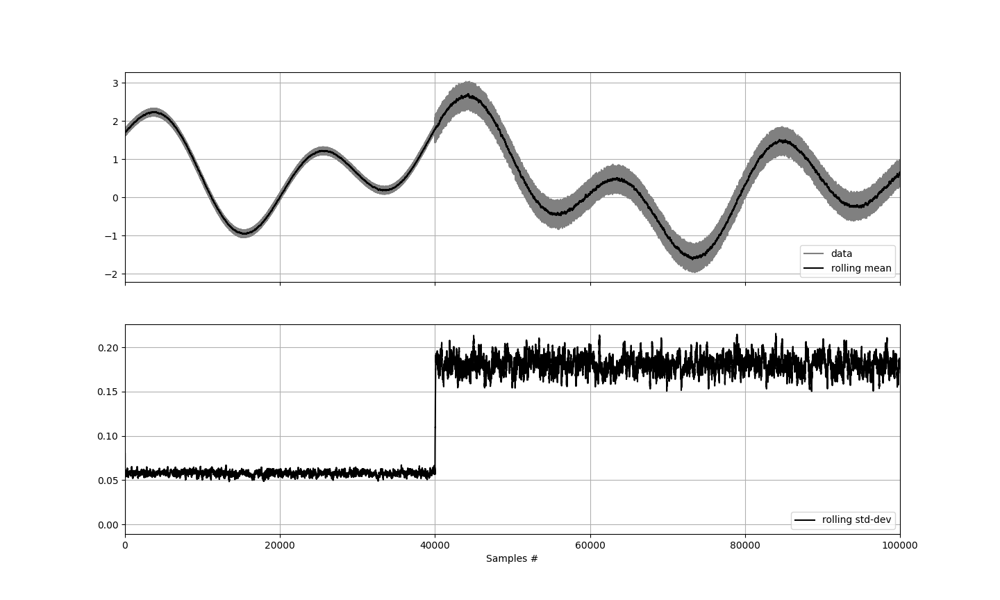

# RWStats

## Overview
**RWStats** is a template header-only C++ library that provides fast and efficient computation of rolling windowed statistics for time-series data. Available statistics are:
 * mean
 * variance
 * standard deviation

The implemented algorithm is suitable for most applications, in particular online and real-time ones. 

## Usage
```cpp
#include<rw_stats.h>

using namespace RWStats;

int main(int argc, char *argv[]) {
    
    size_t window_size = 100;
    RollingWindowedStats<double> rw_stats(window_size);
    
    rw_stats.push_back(0.4);
    rw_stats.push_back(1.5);

    double mean = rw_stats.mean();
    
    return 0;
}
```

## Demo


